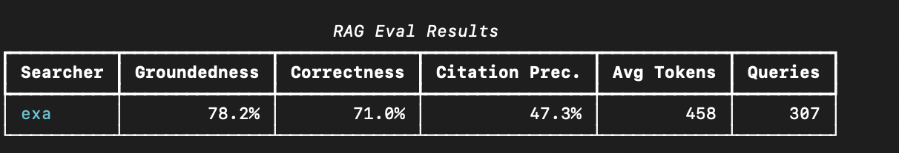

# Study of WebCode Benchmark EXA 

An independent replication of Exa's WebCode Benchmark, built to understand how search quality benchmarking works and how different web search providers extract content for coding agents.This replication builds its own ground truth by rendering each URL in as browser and using Gemini as both the multimodal model for generating the golden markdown and the LLM judge for scoring provider extractions.

## Golden Reference Generation

### What it is

**Golden reference** is a clean markdown representation of what a developer would actually need from that page: prose, code blocks, API signatures, tables, and parameter descriptions, with navigation, ads, and boilerplate stripped out.


### How it was generated

Built an independent golden reference pipeline to evaluate extraction fidelity. For each of the 250 URLs in Exa's code_contents dataset, the following steps were taken:

Rendered the page in a headless Chromium browser using Playwright, with a 1280×800 viewport and a standard Chrome user agent. After initial page load, waited for the DOM to stabilize, then scrolled through the entire page to trigger lazy-loaded content before capturing a full-page screenshot and the fully rendered DOM.
Cleaned the raw DOM by stripping tags that carry no substantive content — <script>, <style>, <svg>, <noscript>, and <iframe>. This typically reduced DOM size by 50–80% without removing any visible page content.
Fed both the screenshot and cleaned DOM to Gemini 2.5 Pro, which produced clean markdown representing the page's substantive content. The screenshot provides layout context (distinguishing main content from navigation and sidebars), while the DOM provides precise text for faithful extraction.

Of the 250 URLs,  successfully generated golden references for 240. The remaining were excluded due to expired domains (3), Cloudflare bot protection (3), connection timeouts (1), non-English content (1), and pages exceeding model input limits (2).

Differences from Exa's pipeline: Exa used Browserbase for rendering and a unspecified multimodal model for markdown generation. 

## Contents Eval

The contents eval measures how faithfully each provider extracts a webpage's content compared to the golden reference. Each provider's API is called with a URL, and the returned content is scored on seven metrics using Gemini 2.5 Pro as the judge model.

Results are reported after filtering anomalies ~9 URLs where extraction returned content but the judge model failed to grade (returning all-zero scores due to quota limits). These are excluded to avoid unfairly penalizing providers for judge-side failures.


Exa outperforms Tavily across all metrics except table recall, where they are nearly identical (88.2% vs 87.9%).
Key observations:
Tavily's low code recall (48.3%) is notable. On inspection, Tavily often preserves code content but formats it using inline backticks (`` ` ``) instead of fenced code blocks (`` ``` ``). The code recall metric counts fenced blocks only, so Tavily is penalized for a formatting difference rather than missing content. For a coding agent, both formats are understandable.
Tavily's structure score (40.9%) reflects a similar pattern: heading hierarchies are often flattened and lists converted to plain text. The content is present but the structural markup is degraded.
Exa's signal score (90.0% vs 77.9%) confirms that Exa's extraction pipeline is more aggressive at stripping navigation chrome, sidebars, and other non-content elements. Tavily returns more raw page content, which increases noise in the context window.
Exa returned empty content for 9 URLs (3.7%). Tavily returned empty content for 15 URLs (6.3%). These empty extractions are counted as zeros in the scores.

Note on Claude web_fetch: 
The original benchmark includes Claude's web_fetch as a third provider in the contents eval. This replication does not test it, because web_fetch was never designed to render JavaScript, it returns only the initial HTML, so JavaScript-rendered pages come back as empty shells. This makes it structurally different from Exa and Tavily, which both render and extract page content, so this replication focuses on those two as the more directly comparable providers.

Note on absolute scores: Scores differ from Exa's published results. This is expected given the different golden reference pipeline (Gemini 2.5 Pro vs Exa's unspecified model) and different judge model (Gemini 2.5 Pro vs GPT-5.4). The relative ranking between providers is the more meaningful comparison.

Metrics explained: 

The contents eval used three LLM-judged metrics and four deterministic metrics.
3 LLM metrics(These three are scored by Gemini 2.5 Pro on a 0–100 scale.):
- Completeness measures what fraction of the golden reference's content is present in the extraction, did the provider capture everything on the page? 
- Accuracy measures whether the extracted content is factually correct and free of hallucinated or garbled text. 
- Structure measures whether headings, lists, tables, and code blocks maintain their original hierarchy and formatting.  
4 deterministic metrics (require no LLM):
- Signal is the ratio of golden reference length to extracted content length, a low score means the extraction contains excess noise like navigation menus and sidebars that the golden reference stripped. 
- Code recall counts how many fenced code blocks (``` or ~~~) from the golden reference appear in the extraction.
- Table recall measures the same for markdown tables.
- ROUGE-L computes the longest common subsequence between the golden reference and extraction, capturing overall textual overlap regardless of structure.


## Rag Eval

Exa's RAG eval tests whether a search provider can find pages on the open web that answer a given technical question. Each provider receives a query from their published dataset of 307 questions and returns 5 search results with extracted content. These results are passed to a synthesis model operating under a strict tabula rasa prompt that it must answer solely from the retrieved text and cannot fall back on training knowledge.

The eval scores two key metrics. Groundedness asks: do the retrieved search results contain the expected answer? This isolates search quality by checking whether the answer exists in the returned content, regardless of what the synthesis model generates. Correctness asks: is the synthesized answer right?  Groundedness is the more meaningful metric for evaluating search providers. Citation precision measures what fraction of the 5 returned results actually contained the answer.


In this run, Exa's default config scores below its published numbers, driven mostly by a retrieval-config detail rather than a quality gap:

1. Exa was configured with max_characters=20000 per result. When it retrieves the correct URL but the relevant passage sits beyond the 20k cutoff, it never reaches the synthesis model resulting in a groundedness score of 0 despite correct retrieval.
2. Model used for this - Gemini 2.5 Pro as the judge and Gemini 2.5 Flash as the synthesis model, whereas Exa used GPT-5.4 and GPT-5-mini respectively. Judge model choice can influence how strictly groundedness is assessed.

Examples investigating individual results: 

In rag_019, the query asks about the maximum hexadecimal digits in CSS1 backslash unicode escapes (expected: "at most four hexadecimal digits"). Parallel retrieves pulling the exact sentence. Exa retrieved the correct URL but the relevant escape syntax section might have sat beyond the 20,000 character extraction cutoff. Tavily retrieved pages describing modern CSS (which allows 6 hex digits), not CSS1's specification of 4.


In rag_020,the query asks which Go version first supported protobuf option retention (expected: "1.29.0"). Parallel retrieved the correct documentation page containing the exact sentence.Exa's retrieved pages were related but did not contain the expected answer. Tavily fetched pages from the right domain but its summarized content did not include the specific version number.


Results when Exa is configured to return only query-relevant highlights and removed the max_character parameter:



Highlights raise groundedness from 68.1% to 78.2% and correctness from 61.6% to 71.0%, while cutting tokens by ~5.6x (2574 → 458) and improving citation precision since each result is now mostly signal rather than a full page.

Against Parallel, the highlights config is close on quality (78.2% vs 84.0% groundedness, 71.0% vs 76.5% correctness) while using ~40% of the tokens (458 vs 1137) and edging it on citation precision (47.3% vs 43.3%).

Parallel: fast vs agentic mode

Parallel's fast mode returns more raw content per result; agentic mode returns more concise, token-efficient results intended for an agent loop. Running the same eval in agentic mode:


Agentic mode holds quality essentially constant while dropping tokens from 1137 to 437 — landing right alongside Exa-highlights' 458. So once both providers are run in their token-efficient configurations, the efficiency gap largely closes, and the providers are comparable on cost; the remaining differences are small relative to the run-to-run drift expected on a live-web eval.

